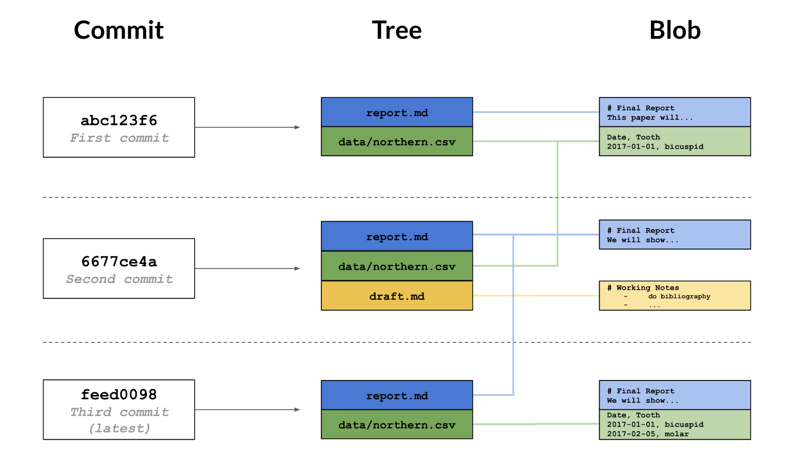

# Summary of git commands

Git has a **staging area** in which it stores files with changes you want to save that haven't been saved yet, you can add more files to this area or take them out as often as you want, but once you commit them, you cannot make further changes

1. git add/rm filename(, filename, ...): put files in the staging area/removes the file and stages the removal
2. git commit: commit everything in the staging area as one unit: when you want to undo changes to a project, you undo all of a commit or none of it
    * arguments
    	* \-m "msg": leave log message
    	* \-\-amend -m "new msg": you want to change the msg you mistyped.
3. git log (\-num: list last num changes): view the log of the history
	* contents (could also be added behind arguments)
		* file path:  shows changes made to that file
    	* directory path: when files were added or deleted in that directory, rather than when the contents of the directory's files were changed
    	* without any filenames will show you all the changes as example in your repository
	* examples:
		contents										           |		   Explanation
        -----------------------------------------------------------| ----------------------------------------------------------------------------------
        commit 0430705487381195993bac9c21512ccfb511056d		|		unique id: hash
		Author: Rep Loop <repl@datacamp.com>		|
		Date:   Wed Sep 20 13:42:26 2017 +0000		|

    		Added year to report title.		|

    	Press the space bar to go down a page or the 'q' key to quit.

4. git status: shows you which files are in staging area, or which files have changes that haven't yet been put there
5. git diff:
    * arguments
    	* \-r: \-r means comparing to a particular revision; HEAD is the shortcut for the most recent commit
	* contents (could also be added behind arguments)
		* file path: compare the file as it currently is to what you last saved
    	* directory path: show you the changes to the files in some directory.
    	* without any filenames will show you all the changes in your repository
    	* ID1..ID2 (6-8 digits of hash): shows the differences between the commits
    	* HEAD(\~1)..HEAD(\~2)
    	* branch\_name\_1..branch\_name\_2

    * examples:

        contents										           |		   Explanation
        -----------------------------------------------------------| ----------------------------------------------------------------------------------
		diff --git a/report.txt b/report.txt            |          diff --git: the command used to produce the output
		index e713b17..4c0742a 100644					|		   a and b are placeholders mearning "the first version" and "the second version"
		--- a/report.txt       							 |		   wherein lines being removed are prefixed with - and lines being added are prefixed with +
		+++ b/report.txt                  				|		   A line starting with @@ that tells where the changes are being made
		@@ -22,3 +22,4 @@ Date,Tooth					|		   The pairs of numbers are start line and number of lines. This diff output indicates changes starting at line 1, with 5 lines where there were once 4
		2017-08-13,incisor								|		   Lines that haven't changed are sometimes shown before
		2017-08-13,wisdom								|		   and after the ones that have in order to give context, 	
		2017-09-07,molar								|		   but no +/- in front of them			 	   
		+2017-11-01,bicuspid	           				|		   A line-by-line listing of the changes with - showing deletions and + showing additions
6. git show (the first 6-8 digits of hash): 	
	* to view the details of a specific commit, use the command with the first few characters of the commit's hash
	* The first part is the same as the log entry shown by git log. The second part shows the changes as with git diff
7. git annotate (file): 
	the command shows who made the last change to each line of a file and when, it will contain:
	* the first eight digits of the hash
	* the author
	* the time of the commit
	* the line number
	* the contents of the line
8. git clean: only work for untracking files; for example, no .gitignore or generate new type of file you do not want and not in .gitignore
    * arguments
    	* \-n (num: num of lines): show you a list of files that are in the repository, but whose history Git is not currently tracking
    	* \-f: will then delete those files
9. git config: most of Git's settings should be left as they are, only two you should set on every computer you use: name and email address
    * arguments
    	* \-l (\-\-list): show you a list of files that are in the repository, but whose history Git is not currently tracking
    	* one of three additional options \-l/setting value(change to)
    		* \-\-system: settings for every user on this computer.
    		* \-\-global: settings for every one of your projects.
    		* \-\-local: settings for one specific project.

    		Each level overrides the one above it, so local settings (per-project) take precedence over 
    		global settings (per-user), which in turn take precedence over system settings (for all users on the computer).
10. git reset (file\_path/HEAD): if you accidentally stage a file you shouldn't have; 
								If you staged not only the one you do not want, it will unstage all files you have put in staging area
								It is better to reset file_path if staged more.
11. git checkout: loading the saved (commited version)
	* arguments
		* branch\_name: create a new branch if it does not exist or switch to that branch only when all of your changes have been committed
		* \-b branch\_name: create a new branch and switch to it
		* \-\- file\_path: if the file staged and made changes again (did not git add in staging), then want to undo them. 
						  Git will discard the changes that have not yet been staged (undo changes to unstaged files)
		* hash (6-8 digits) file_path: replace the current version of file with the version that was commited with hash
									   Restoring a file doesn't erase any of the repository's history. 
									   Instead, the act of restoring the file is saved as another commit, because you might later want to undo your undoing.
									   Remember to commit the restored version of file
12. git reset (HEAD) (file_path/dir/.): unstage the file first\\
	git checkout -- (file_path/dir/.): undo the changes since the last commit
	Combining them together, it will undo all changes if directly use git reset, otherwise, to a staged file/files in the dir/files in the current dir
13. git merge source destination -m "msg"
	* If those changes don't overlap, the result is a new commit in the destination branch that includes everything from the source branch
	* When there is a conflict during a merge, Git cannot automatically merge, 
	and running git status after the merge reminds you which files have conflicts that you need to resolve by printing both modified: beside the files' names.
	In many cases, the destination branch name will be HEAD because you will be merging into the current branch. To resolve the conflict, 
	edit the file to remove the markers and make whatever other changes are needed to reconcile the changes, then commit those changes.
14. git push remote branch-name

# Created a repository
1. git init project-name to create a repository for a new project in the current working directory
One thing you should not do is create one Git repository inside another. While Git does allow this, 
updating nested repositories becomes very complicated very quickly, 
since you need to tell Git which of the two .git directories the update is to be stored in.
2. convert existing projects into repositories: git init in the project's root directory, or git init /path/to/project
3. git clone URL new_name
	* If you are in a repository, you can list the names of its remotes using git remote.
	* If you want more information, you can use git remote -v (for "verbose"), which shows the remote's URLs. 
	Note that "URLs" is plural: it's possible for a remote to have several URLs associated with it for different purposes, 
	though in practice each remote is almost always paired with just one URL.

# How git store information 

	1. A commit contains metadata such as the author, the commit message, and the time the commit happened. 
	2. Each commit also has a tree, which tracks the names and locations in the repository when that commit happened
	3. For each of the files listed in the tree, there is a blob. This contains a compressed snapshot of the 
	contents of the file when the commit happened (blob is short for binary large object, 
	which is a SQL database term for "may contain data of any kind")

## hash:
	It is generated by running the changes through a pseudo-random number generator called a hash function.
	This hash is normally written as a 40-character hexadecimal string like 7c35a3ce607a14953f070f0f83b5d74c2296ef93, 
	but most of the time, you only have to give Git the first 6 or 8 characters in order to identify the commit you mean.
	if two commits contain the same files and have the same ancestors, their hashes will be the same as well. 
	Git can therefore tell what information needs to be saved where by comparing hashes rather than comparing entire files.

## Abs and relative path
	A hash is like an absolute path: it identifies a specific commit. 
	There is also the equivalent of a relative path. The special label HEAD, which we saw in the previous chapter, 
	always refers to the most recent commit. The label HEAD~1 then refers to the commit before it, 
	while HEAD~2 refers to the commit before that, and so on.
	
# Git ignore
	Creating a file in the root directory of repository called .gitignore and storing a list of wildcard patterns that 
	specify the files you don't want Git to pay attention to
# Branches
	Branches, which allows you to have multiple versions of your work, and lets you track each version systematically.
# What happens if I try to pull when I have unsaved changes?
	Cannot pull when you have unsaved change in local.
	Either commit your local changes or revert them, and then try to pull again.

